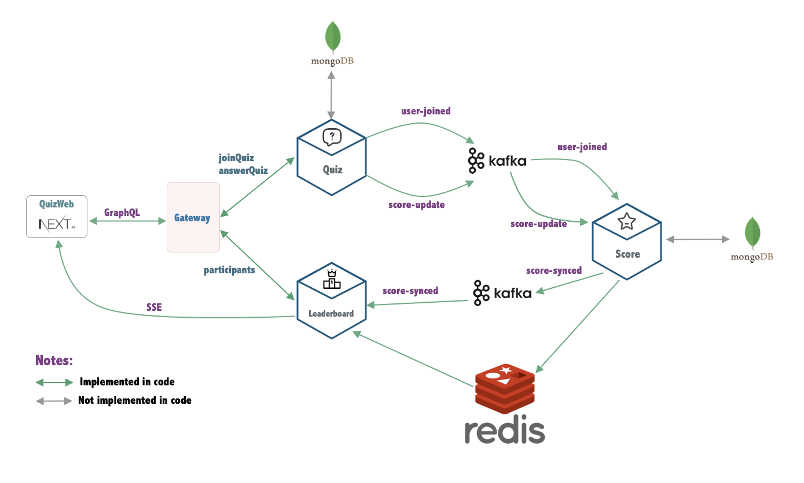

# Code Implementation

This directory contains the implementation of a backend project for the coding challenge. The project is structured into multiple components and microservices. Below is a description of each implemented component:

## Components Overview

### 1. Gateway
- **Description**: A simple API Gateway built using **NestJS** and **GraphQL Federation**.
- **Purpose**: Acts as a super GraphQL service that connects with two sub-GraphQL services: `quiz` and `leaderboard`.

### 2. Quiz
- **Description**: A microservice responsible for handling quiz-related logic.
- **APIs**:
  - `joinQuiz`: Allows a user to join a quiz.
  - `answerQuiz`: Handles user quiz answers. For demo purpose, each time user answer a question the score will increase 1

### 3. Score
- **Description**: A service responsible for processing events generated by the `quiz` service.
- **Functionality**:
  - Updates user scores in **Redis**.
  - Stores score data into the **NoSQL** database.

### 4. Leaderboard
- **Description**: A service for managing the leaderboard functionality.
- **APIs**:
  - `participants`: Provides a list of participants who joined a quiz.
- **Additional Features**:
  - Provides **score-synced** events via **Server-Sent Events (SSE)** when a user's score is synced.

### 5. QuizWeb
- **Description**: A simple web application to test the implemented functionality.
- **Features**:
  - Users can join a quiz.
  - Users can answer quiz questions.
  - Users can view the leaderboard.

## Notes
- **Implemented Components**: All core services (gateway, quiz, score, leaderboard, quizweb) are functional.
- **Technologies Used**:
  - **NestJS** for backend services.
  - **GraphQL Federation** for API composition.
  - **Kafka** for event streaming.
  - **Redis** for caching scores.
  - **SSE** for real-time updates.

## Architecture Diagram
The following diagram illustrates the architecture of the project:




# How to Run the Project

## Prerequisites
Ensure you have the necessary tools installed:
- Docker and Docker Compose
- Node.js

## Steps to Run the Project

1. Start `Kafka` and `Redis` Services
   Run the following command in the project root directory to start the necessary services:
   ```bash
   docker-compose up -d
2. Run Each Component
   Follow the instructions in the `README.md` file of each component to run the following services:
   - `quiz`
   - `leaderboard`
   - `score`
   - `gateway`
   - `quizweb`

  You can update environment variables in the `.env` file. For quick local testing, `.env` files have already been added for each component (these should be ignored in version control).

1. Component Startup Order
   - Start the `quiz` and `leaderboard` components first.
   - Once both services are fully running, start the `gateway` component.

## Notes
- Make sure to follow the setup instructions in each component's `README.md` file.
- Verify that all dependencies are installed and services are configured correctly before starting.

## Things to Improve

1. **Store Data to Database**
   - Ensure all necessary data is properly stored in a database for persistence.

2. **Optimize Redis Usage**
   - Remove data from Redis for completed quizzes to improve performance, especially when handling large datasets.

3. **Write Tests**
   - Implement the following types of tests:
     - Unit tests
     - End-to-End (E2E) tests
     - Performance tests

4. **Enhance Docker Setup**
   - Add all components to the `docker-compose` file, allowing all services to be started simultaneously with a single command.
