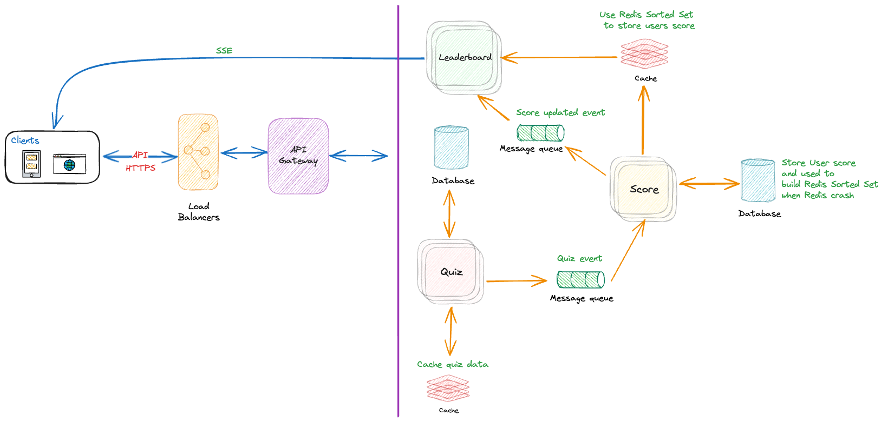

# **Vocabulary Quiz - System Design**

# Introduction

This document outlines the architecture design for a scalable, real-time Vocabulary Quiz system. The platform is designed to support large-scale user interactions while ensuring seamless performance and reliability.

The system enables users to participate in vocabulary quizzes, track scores, and view leaderboards in real time. By leveraging modern technologies and efficient design principles, the platform will deliver a highly engaging user experience.

Key features of the system include:
- Real-time leaderboard updates based on user scores.
- Robust and scalable architecture to handle a large number of concurrent users.
- Modular design to facilitate future enhancements and maintenance.

This document includes the high-level architecture, detailed components, data flow diagrams, and the technology stack used to build the system.

# **High-Level Architecture**
## Overview

The Vocabulary Quiz system employs a **microservice architecture** to achieve scalability, maintainability, and fault tolerance. Each microservice is designed to handle a specific function, such as managing quizzes, user scores, and leaderboards. This approach enables independent development, deployment, and scaling of services, ensuring the system can handle real-time updates and high traffic.

The architecture is designed to:
- Support large-scale, real-time user interactions.
- Use a **message queue** to ensure reliable and asynchronous communication between services.
- Leverage **caching mechanisms** for improved performance and reduced latency.

## Diagram

The following diagram illustrates the high-level architecture of the Vocabulary Quiz system:

### Alternative
In the above diagram, we separated the system into three services: `Leaderboard`, `Quiz`, and `Score`. However, we also considered an alternative approach that only uses two services: `Leaderboard` and `Quiz`. In this design, the Score service is merged into the `Leaderboard` service.

This approache has some pros and cons:
#### Pros:
- `Simplicity`: Fewer services reduce deployment and management overhead.
- `Lower Latency`: Eliminates inter-service communication between Score and Leaderboard.
#### Cons:
- `Tightly Coupled Responsibilities`: Leaderboard becomes overloaded with multiple responsibilities (score storage, processing, and ranking).
- `Scalability Challenges`: The merged Leaderboard service may face performance bottlenecks under high load.
- `Higher Risk of Failure`: A failure in the Leaderboard service would impact both scoring and ranking functionalities.
- `Reduced Flexibility`: Future enhancements to scoring logic or leaderboard features would require changes in the same service, increasing the risk of introducing bugs.

Base on above **Pros** and **Cons** We Chose a Separate Score and Leaderboard Service design because it provides better scalability, fault isolation, and modularity.

# Components
### Client
The client refers to the frontend application, which could be a mobile app or a web app. It interacts with the backend system via the API Gateway. The client is responsible for presenting quiz content, capturing user responses, and displaying leaderboard data.

### Load Balancer
The load balancer ensures high availability and scalability by distributing incoming requests across multiple instances of the API Gateway. It handles HTTPS termination and provides fault tolerance.

### API Gateway
The API Gateway acts as a single entry point for all client requests. It routes requests to the appropriate microservices (Quiz, Leaderboard, or Score) based on the endpoint. It also handles security features such as authentication, rate limiting, and logging.

### Leaderboard Service
The Leaderboard service is responsible for maintaining and serving real-time leaderboard data. It uses a Redis Sorted Set to store and retrieve user scores efficiently. It processes Score Updated events from the message queue to update the leaderboard rankings.

### Quiz Service
The Quiz service manages all quiz-related functionality, including creating and storing quizzes, retrieving quiz content, and calculating results based on user submissions. It interacts with the Quiz Database and caches frequently accessed quiz data to optimize performance.

### Score Service
The Score service tracks and calculates user scores. It stores scores in its database and generates events for score updates, which are sent to the message queue. This ensures other services, like Leaderboard, stay synchronized.

### Cache Quiz Data
To reduce latency and improve scalability, quiz data is cached in a distributed cache. Frequently accessed quizzes and their metadata are stored here, reducing the load on the Quiz Database.

### Redis Cache for Sorted Set to Store User Scores
Redis is used as a high-performance, in-memory data store for leaderboard rankings. The Sorted Set data structure in Redis allows efficient ranking, retrieval, and updates of user scores.

### Message Queue: Quiz Event
This message queue is used to decouple the Quiz and Score services. When a user completes a quiz, the Quiz service publishes a Quiz Event. The Score service consumes this event, processes the score, and updates its database.

### Message Queue: Score Updated Event
This message queue is used to synchronize the Score and Leaderboard services. When a user’s score is updated, the Score service publishes a Score Updated Event. The Leaderboard service consumes this event to update the leaderboard rankings in real time. We can also use this queue to send event when a user join a quiz session, Score service will receive this event and set user score to 0 to database and Redis. Base on this information we can display on leaderboard or send notification when have new user join a quiz session.

### Database for Quiz
The Quiz Database stores quiz-related data such as questions, answers, quiz session.

### Database for Score Services
The Score Database stores user scores, which can be used to rebuild the leaderboard in case of a Redis crash.

# Data Flow

## Main data flow
The main data flow describes the complete process, from when a user joins a quiz to when their score is updated in the leaderboard. This ensures that the client's UI displays real-time updates as users submit answers and scores are updated.

### Key Flow Description

1. **User Joins the Quiz**:
   - The **Client** sends a request to the **QuizService** to join a quiz session.
   - The **QuizService** emits a **Quiz Event** to the **Quiz Event Queue** to indicate a new user has joined.
   - The **ScoreService** processes the **Quiz Event**:
     - Sets the user's initial score to `0` in the **Database**.
     - Updates the **Redis Sorted Set** with the new user and their score.
   - The **ScoreService** emits a **User Score Updated** event to the **Score Event Queue**.
   - The **LeaderboardService** listens to the **User Score Updated** event and notifies the **Client** via **SSE**.
   - The **Client** updates the UI to reflect the new user with an initial score of `0`.

2. **Client Fetches Participants**:
   - The **Client** sends a request to the **LeaderboardService** to get the current list of participants.
   - The **LeaderboardService** retrieves the list of participants and their scores from the **Redis Sorted Set**.
   - The list of participants is returned to the **Client** and displayed in the UI.

3. **User Submits an Answer**:
   - The **Client** sends the submitted answer to the **QuizService**.
   - The **QuizService** validates the answer and emits a **Quiz Answered Event** to the **Quiz Event Queue**.
   - The **ScoreService** processes the **Quiz Answered Event**:
     - Updates the user’s score in the **Database**.
     - Updates the **Redis Sorted Set** with the new score.
   - The **ScoreService** emits a **User Score Updated** event to the **Score Event Queue**.
   - The **LeaderboardService** listens to the **User Score Updated** event and notifies the **Client** via **SSE**.
   - The **Client** updates the UI to reflect the new score.

### Real-Time Updates

The real-time updates in the system are managed through a combination of **Server-Sent Events (SSE)** and efficient data storage mechanisms.

1. **Server-Sent Events (SSE)**:
   - A persistent connection is established between the **LeaderboardService** and the **Client**.
   - Real-time events, such as a new user joining or a user’s score being updated, are pushed to the **Client**.

2. **Redis Sorted Set**:
   - Acts as a real-time cache to store user scores with efficient ranking capabilities.
   - Scores are quickly updated in the **Redis Sorted Set** whenever the **ScoreService** processes a new event.

3. **Database**:
   - Stores historical quiz data and user scores.
   - Serves as a backup to rebuild the **Redis Sorted Set** in case of failure.

This flow ensures that:
- **Clients** receive immediate updates when events occur (e.g., new users join or scores are updated).
- The leaderboard remains up-to-date and reflects real-time scores.
- **Redis Sorted Set** enables fast score retrieval, while the **Database** guarantees data persistence.

## Quiz Participants
This diagram describes the flow for retrieving the list of participants and their scores to display in the client UI. The API is triggered when a user joins a quiz session.

The process involves the following steps:
1. The **Client** sends a request to the **LeaderboardService** to retrieve the list of participants for the quiz session.
2. The **LeaderboardService** queries the **Redis Sorted Set** to get the participants and their scores.
3. The **Redis Sorted Set** responds with the list of participants and their corresponding scores.
4. The **LeaderboardService** returns the list of participants and scores to the **Client**.
5. The **Client** displays the participant list and scores on the leaderboard UI.

After retrieving the initial list of participants, the **Client** relies on **Server-Sent Events (SSE)** to update the leaderboard dynamically. SSE events, such as:
- **New user joined**: Updates the leaderboard with the new participant.
- **User score updated**: Updates the leaderboard when an existing participant's score changes.

## User join Quiz
When a user joins a quiz, we need to record this user in the leaderboard and store this event in the database for historical quiz session tracking. This flow ensures that the list of participants is properly maintained and can be queried by the client to display in the UI.

The process also sets up a **Server-Sent Events (SSE)** connection between the client and the **LeaderboardService**, enabling real-time updates when new participants join or scores are updated.

# Technologies and Tools
This section outlines the technical decisions and tools used to design the Realtime Quiz System. The architecture prioritizes scalability, performance, and real-time communication to deliver a seamless user experience.

## Microservices Architecture

We have chosen a **Microservices Architecture** to design the **Realtime Quiz System**. This approach provides the following key benefits:

- **Scalability**: Each service (e.g., Quiz, Score, Leaderboard) can scale independently based on workload, ensuring efficient resource utilization.
- **Maintainability**: Services are decoupled, allowing teams to develop, test, and deploy components independently without affecting the entire system.
- **Flexibility**: Different technologies can be used for different services, optimizing performance for specific tasks (e.g., Redis for caching scores).
- **Fault Isolation**: Failures in one service do not impact the availability of others, improving overall system resilience.
- **Deployment Efficiency**: Independent deployment enables faster updates and reduces downtime.

By adopting Microservices, we ensure a scalable, maintainable, and resilient architecture for the **Realtime Quiz System**.

## API Selection: GraphQL

We have selected **GraphQL** as the API technology for the **Realtime Quiz System**, instead of REST or gRPC. The following reasons justify this choice:

- **Flexible Data Fetching**: Clients can request exactly the data they need, reducing over-fetching and under-fetching common in REST APIs.
- **Efficient Communication**: A single GraphQL query can retrieve data from multiple services (e.g., Quiz, Score, Leaderboard) in one request, improving performance and reducing network latency.
- **Schema-Driven Development**: GraphQL enforces a strongly-typed schema, making it easier to understand, document, and evolve the API.
- **Client-Centric**: GraphQL provides a consistent and predictable API structure, which enhances the developer experience for frontend teams.

By using **GraphQL**, we ensure efficient, flexible, and streamlined data communication between clients and the backend services in the **Realtime Quiz System**.

## Realtime Communication: Server-Sent Events (SSE)

For real-time communication between the client and backend, we have chosen **Server-Sent Events (SSE)** instead of WebSockets.

### Justification for SSE
- **Read-Heavy Workload**: In this system, the client primarily listens for real-time updates (e.g., leaderboard scores) from the backend. SSE is well-suited for heavy read operations with minimal write requirements.
- **Simplicity**: SSE is lightweight, easy to implement, and works seamlessly over standard HTTP/HTTPS connections, unlike WebSockets, which require a persistent bidirectional connection.
- **API for Writes**: Since write operations (e.g., submitting quiz scores) are low in volume, they are handled efficiently through the API instead of real-time communication.

### Limitations of SSE
While SSE is a great fit for our use case, we acknowledge its limitations compared to WebSockets:
- **Unidirectional Communication**: SSE supports only server-to-client communication. For bidirectional communication, WebSockets would be required.
- **Connection Limits**: Browsers may limit the number of simultaneous SSE connections per domain.
- **Text-Only Data**: SSE can only send text-based data (UTF-8 encoded). Binary data transmission is not supported, unlike WebSockets.

Despite these limitations, **SSE** is ideal for our system's real-time requirements due to its simplicity and focus on server-to-client data streaming.

## Database: Redis

We have chosen Redis as the database solution for the Realtime Quiz System, leveraging its in-memory data structure store capabilities and Sorted Set feature.

### Justification for Redis
- **In-Memory Performance**: Redis operates primarily in memory, offering extremely low latency for read and write operations, which is essential for real-time score updates and leaderboard generation.
- **Sorted Sets for Leaderboards**: Redis provides native support for Sorted Sets, which makes it highly efficient for ranking user scores and retrieving leaderboard data based on score ranges or rankings.
- **Scalability**: Redis supports horizontal scaling through clustering, ensuring the system can handle a growing number of users and increasing real-time data demands.
- **Atomic Operations**: Redis ensures atomicity for operations like incrementing scores and updating leaderboards, reducing the risk of data inconsistencies in high-concurrency environments.
- **Ease of Integration**: Redis has robust support for various programming languages and frameworks, ensuring seamless integration with the NestJS application backend.

By choosing Redis, we ensure high-performance, low-latency, and scalability, along with features specifically suited to real-time systems like the Realtime Quiz System.

## Database: NoSQL

We have chosen a **NoSQL database** for the **Realtime Quiz System** instead of a traditional SQL database.

### Justification for NoSQL
- **Flexible Schema**: NoSQL allows dynamic and flexible data structures, which are ideal for storing varied and evolving quiz data, scores, and leaderboard entries.
- **High Scalability**: NoSQL databases are designed for horizontal scaling, making them capable of handling large volumes of data and traffic efficiently.
- **Performance**: NoSQL provides fast read and write operations, which is critical for real-time updates to the leaderboard and scores.
- **Optimized for JSON**: Data in the system (e.g., quiz results and user scores) can be stored in JSON-like formats, enabling seamless integration with APIs and modern backend services.

By choosing **NoSQL** solutions like `MongoDB` or `DynamoDB`, we ensure scalability, flexibility, and high performance, making them an ideal fit for the demands of the **Realtime Quiz System**.

## Communication Between Services: Message Queue (Kafka)

For communication between services, we have chosen to use a **message queue** instead of direct API calls (REST/GraphQL/gRPC). Specifically, we have selected **Kafka** as our message queue solution.

### Justification for Message Queue
- **Asynchronous Communication**: Message queues enable asynchronous communication between services, which helps decouple components and allows them to operate independently without direct, real-time dependency on each other.
- **Scalability**: Kafka can handle high-throughput and large-scale data streaming, making it well-suited for systems with high volumes of events and real-time processing, such as our quiz system.
- **Reliability**: Kafka guarantees message delivery and ensures that no data is lost in case of service failures, improving the system's reliability.
- **Event-Driven Architecture**: By using a message queue, we enable an event-driven architecture, where services respond to events like score updates or quiz submissions, rather than relying on traditional API calls.

### Why Kafka over SQS or RabbitMQ?
- **High Throughput**: Kafka is optimized for high-throughput messaging, making it ideal for scenarios like the real-time score updates in our system, where millions of events may need to be processed quickly.
- **Durability and Fault Tolerance**: Kafka ensures message durability and supports replication, which provides greater fault tolerance compared to SQS or RabbitMQ.
- **Distributed Nature**: Kafka is designed for distributed environments, providing better scalability and performance across multiple nodes compared to other message queue systems.

By choosing **Kafka** as the message queue, we ensure robust, scalable, and reliable communication between services in the **Realtime Quiz System**.

## Backend Framework: Node.js / NestJS

For the backend of the **Realtime Quiz System**, we have selected **Node.js** with **NestJS** as the framework.

### Justification for Node.js and NestJS
- **Node.js**:
  - **High Performance**: Node.js is built on the V8 JavaScript engine, which allows for non-blocking, asynchronous I/O operations, making it ideal for handling numerous concurrent connections, such as real-time quiz updates.
  - **Scalability**: Its event-driven architecture allows for easy scaling, which is essential for a real-time system that needs to handle many users at once.
  - **Large Ecosystem**: With Node.js, we can leverage a vast ecosystem of packages and libraries, speeding up development and ensuring robust, well-supported features.

- **NestJS**:
  - **Modular Structure**: NestJS provides a modular architecture, which aligns well with the microservices approach. It allows us to build services with clear separation of concerns, improving maintainability.
  - **TypeScript Support**: NestJS is built with TypeScript, providing type safety, enhanced developer tooling, and better code quality, making it easier to maintain and scale the system.
  - **Built-in Features**: NestJS comes with built-in support for things like dependency injection, middleware, and routing, reducing the need for boilerplate code and allowing developers to focus on business logic.
  - **Microservices Compatibility**: NestJS natively supports microservices, making it an ideal choice for our distributed architecture, where services need to communicate efficiently.
